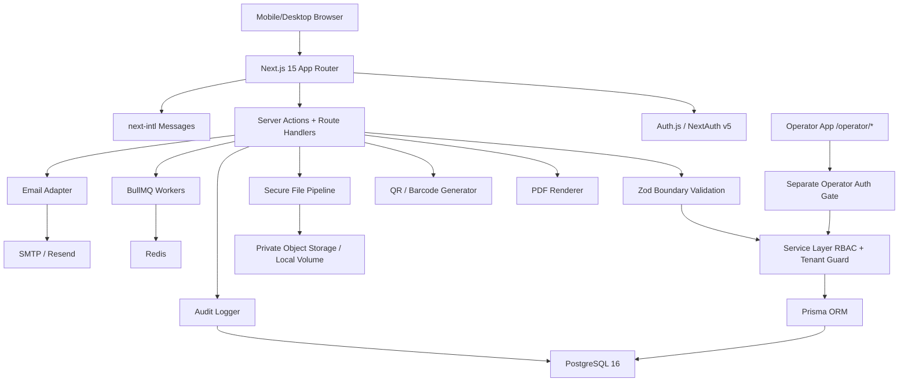

# Drywall OS Plan

## System Overview

Drywall OS is a production-grade operating platform for `[FRIEND'S DRYWALL LLC NAME]`, a small but growing drywall contractor that needs to estimate faster, track jobs from lead to payment, generate bilingual customer documents, manage crews/materials/expenses, and look more professional than larger competitors.

The first production milestone will ship a secure, mobile-first contractor workflow:

1. Owner selects English or Spanish.
2. Owner registers, logs in, and creates a business profile.
3. Owner creates a customer and drywall job.
4. Owner builds a drywall-specific estimate and generates a PDF.
5. Owner converts the estimate into an invoice and generates a PDF.
6. Owner logs an expense with receipt upload and exports expenses to CSV.
7. Owner uploads before/after job photos.
8. Owner generates a QR code for invoice/job portal access.
9. Owner views dashboard metrics.
10. Standard Automata operator views tenant and usage metrics.

Core promise: **Estimate faster. Track every job. Invoice professionally. Get paid faster.**

## Target Users

- **Owner:** needs quick estimates, invoices, cash-flow visibility, customer records, and job status from a truck or jobsite.
- **Office Manager:** needs customer/job organization, document generation, expense export, and follow-up tracking.
- **Crew Lead / Worker:** needs assigned jobs, notes, photos, labor logs, punch lists, and mobile-friendly updates.
- **Bookkeeper:** needs clean invoices, payment records, expense categories, receipt files, mileage records, and CSV export.
- **Customer / Property Manager / General Contractor:** needs professional bilingual estimates, invoices, job updates, approvals, PDFs, photos, and payment-link placeholders.
- **Standard Automata Operator:** needs tenant health, deployment, subscription, support, audit, storage, user, and usage visibility through a separate operator auth gate.

## Architecture Diagram



## Folder Structure

```text
drywall-os/
├── app/
│   ├── [locale]/
│   │   ├── (auth)/
│   │   │   ├── login/
│   │   │   └── register/
│   │   ├── (dashboard)/
│   │   │   ├── jobs/
│   │   │   ├── estimates/
│   │   │   ├── invoices/
│   │   │   ├── customers/
│   │   │   ├── expenses/
│   │   │   ├── materials/
│   │   │   ├── crew/
│   │   │   ├── reports/
│   │   │   ├── settings/
│   │   │   └── page.tsx
│   │   ├── operator/
│   │   ├── layout.tsx
│   │   └── page.tsx
│   ├── api/
│   │   ├── auth/
│   │   ├── exports/
│   │   ├── files/
│   │   ├── invoices/
│   │   ├── estimates/
│   │   └── qr/
│   ├── globals.css
│   └── layout.tsx
├── components/
│   ├── ui/
│   ├── jobs/
│   ├── estimates/
│   ├── invoices/
│   ├── customers/
│   ├── expenses/
│   ├── materials/
│   ├── crew/
│   ├── qr/
│   └── dashboard/
├── lib/
│   ├── auth/
│   ├── db/
│   ├── i18n/
│   ├── rbac/
│   ├── validation/
│   ├── services/
│   ├── pdf/
│   ├── qr/
│   ├── audit/
│   ├── files/
│   ├── email/
│   └── observability/
├── messages/
│   ├── en.json
│   ├── es.json
│   ├── vi.json
│   ├── sq.json
│   └── hmn.json
├── prisma/
│   ├── schema.prisma
│   ├── migrations/
│   └── seed.ts
├── tests/
│   ├── unit/
│   ├── integration/
│   └── e2e/
├── docker/
│   ├── Dockerfile
│   └── docker-compose.prod.yml
├── PLAN.md
├── README.md
├── SECURITY.md
├── DEPLOYMENT.md
├── .env.example
└── package.json
```

## Database Schema Plan

The Prisma schema will be tenant-first. Every tenant-scoped production model includes `tenantId`, `createdAt`, `updatedAt`, and `deletedAt` where soft deletion is appropriate. Core indexes will cover `tenantId`, foreign keys, `status`, and `createdAt`.

### Identity, Tenant, Billing

- `Tenant`: business account root, slug, status, plan, locale, usage counters.
- `User`: email, name, password hash, preferred locale, 2FA flags, lockout metadata.
- `BusinessProfile`: company name, license/tax fields, address, phone, email, branding, default terms, currency.
- `Membership`: tenant/user relationship with role and status.
- `SubscriptionPlan`, `Subscription`: pricing-ready manual billing adapter now, Stripe-ready later.
- `ApiKey`: tenant-scoped future API access with hashed token and audit metadata.

### Customer, Job, Estimate, Invoice

- `Customer`: contact, billing address, type, notes, preferred language.
- `Job`: customer, address, workflow status, job type, dates, assigned crew, payment status, notes.
- `DrywallJobDetails`: square footage, rooms, ceiling height, thickness, board type, finish level, texture type, cutouts, corners.
- `RoomScope`: per-room scope, dimensions, finish/texture notes.
- `JobStatusHistory`: append-only workflow transitions.
- `Estimate`, `EstimateLineItem`, `MaterialEstimate`: estimating records, customer/internal views, deposit, approval, PDF metadata.
- `Invoice`, `InvoiceLineItem`, `Payment`: billing, partial payments, progress billing, final balance, overdue tracking.
- `ChangeOrder`, `ChangeOrderLineItem`: approval-gated changes that cannot affect invoices until approved.

### Crew, Labor, Materials, Expenses

- `Crew`, `CrewMember`, `CrewAssignment`: crews, roles, availability, assignment windows.
- `LaborEntry`: job-specific time logs, task category, billable flag, cost snapshot.
- `Material`, `Supplier`, `MaterialInventoryTransaction`: inventory, suppliers, purchase/usage/adjustment logs.
- `Expense`, `ExpenseCategory`, `MileageEntry`, `ReceiptFile`: tax helper, receipts, mileage, accountant export.

### Files, Photos, QR, AI, Operator

- `JobPhoto`: private file reference, category, visibility, sanitized metadata.
- `CodeAsset`, `CodeTemplate`, `CodeScanEvent`, `LabelTemplate`: QR/barcode generation, scan analytics, label exports.
- `VoiceTranscript`, `AIExtraction`: original transcript, extracted JSON, prompt version, confirmation status.
- `AuditLog`: tenant hash-chained audit log.
- `OperatorAuditLog`: operator-only hash-chained audit log.
- `SupportTicket`, `SupportMessage`, `DeploymentInstance`: operator console support and infrastructure visibility.

## Drywall Workflow Design

Job pipeline statuses are explicit and drywall-specific:

```text
Lead -> Site visit scheduled -> Estimate drafted -> Estimate sent -> Estimate approved
-> Deposit received -> Materials ordered -> Scheduled -> In progress
-> Hanging drywall -> Taping / mudding -> Sanding -> Texture
-> Touch-up / punch list -> Completed -> Invoiced -> Paid -> Archived
```

The job board will expose clear status badges and next-action buttons. The service layer will enforce legal transitions, append `JobStatusHistory`, and audit money-moving or customer-visible changes.

## Estimate And Invoice Flow

1. Owner creates a customer and job.
2. Estimate builder loads drywall templates such as patch repair, garage drywall, basement drywall, commercial buildout, ceiling texture repair, and water damage repair.
3. Owner enters square footage, rooms, board type, finish level, texture, labor, materials, fees, markup, tax, and deposit.
4. Zod validates inputs and normalizes money to integer cents.
5. Service layer checks `estimate:create` permission and tenant scope.
6. Estimate is saved as draft with line items.
7. Owner generates a bilingual PDF estimate using sanitized data and tenant branding.
8. Estimate approval marks approval state and can request deposit.
9. Approved estimate converts to invoice in one action.
10. Invoice supports deposit tracking, partial payments, change-order line items, payment status, overdue status, PDF output, and QR payment-link placeholder.

No AI or voice workflow can auto-save money-affecting records. It must create a reviewable draft.

## I18n Strategy

- Use `next-intl` with App Router and route prefix `/{locale}`.
- Supported locales from day one: `en`, `es`, plus future-ready `vi`, `sq`, `hmn`.
- All user-facing strings live in `messages/*.json`.
- Namespaces: `common`, `nav`, `auth`, `dashboard`, `customer`, `job`, `estimate`, `invoice`, `expense`, `materials`, `crew`, `changeOrder`, `photos`, `pdf`, `qr`, `errors`, `admin`.
- Language switcher writes a cookie and user preference when authenticated.
- Dates, currency, and numbers use `Intl`.
- PDFs can render bilingual customer language plus English.
- Layout and message loading stay RTL-ready even though initial locales are LTR.

## Security Model

### Authentication

- Auth.js / NextAuth v5 session handling.
- Credentials provider with Argon2id password hashing.
- Login and password reset rate limits.
- Account lockout after repeated failures.
- Token/session rotation after privilege changes.
- Optional TOTP 2FA for tenant users.
- Mandatory 2FA for operator/admin accounts.

### Authorization

Roles:

- Owner
- Manager
- CrewLead
- Worker
- Bookkeeper
- Auditor
- StandardAutomataAdmin

Permissions are checked in the service layer, not only in the UI. Operator routes use a separate auth gate and role set.

### Multi-Tenancy

- All tenant-scoped rows include `tenantId`.
- Prisma access goes through tenant-aware helpers and middleware/extension patterns.
- Raw SQL is forbidden by default and only allowed through an audited allowlist.
- Cross-tenant IDs are rejected by service-layer guards.

### Data Safety

- Zod validation at every server action, route handler, and AI extraction boundary.
- Safe translated error envelopes.
- Request IDs in logs and surfaced in UI error messages.
- CSV injection protection for exports.
- PDF text sanitization for customer-provided content.
- No secrets committed; `.env.example` documents required config.
- Pre-commit secret scanning documented and recommended.

### Audit Logging

Audit logs are append-only and hash-chained where practical. Events include auth, estimate/invoice lifecycle, payments, expenses, change orders, customer changes, RBAC changes, exports, admin actions, and AI extraction approvals.

## File Upload Model

Receipt and job photo uploads use a private file pipeline:

1. Accept only configured MIME types and extensions.
2. Validate magic bytes server-side.
3. Enforce file size limits.
4. Strip EXIF metadata.
5. Re-encode images to safe formats.
6. Store outside webroot on a private volume or object store.
7. Persist metadata only after successful processing.
8. Serve through signed URLs with tenant and permission checks.
9. Record audit events for uploads, deletes, customer-visible publication, and exports.

Initial implementation will support before/after job photos and receipt photos with server-side validation and private local storage. Production deployment can swap the storage adapter for S3-compatible storage without changing callers.

## QR And Code Model

QR and barcode generation supports:

- Invoice QR code
- Payment-link placeholder QR
- Job folder QR
- Estimate approval QR
- Customer portal QR
- Material inventory barcode
- Tool/equipment barcode
- Review-request QR
- Warranty/workmanship QR

Rules:

- Always generate a fallback standard QR.
- Validate QR scannability before marking ready.
- Warn when decorative styling is too complex.
- Do not distort linear barcodes.
- Sanitize SVG output.
- Validate uploaded logos through the file pipeline.
- Tenant-scope every generated asset and scan event.

Initial milestone ships a basic tenant-scoped QR code for invoice/job portal links with PNG/SVG export and PDF embedding hooks.

## Deployment Plan

Production target: self-hostable on a Dell PowerEdge and SaaS-ready for future multi-tenant hosting.

Services:

- Next.js application container.
- PostgreSQL 16 container or managed instance.
- Redis container for BullMQ.
- Worker container for background jobs.
- Private uploads volume.
- Optional reverse proxy/TLS terminator.

Deployment artifacts:

- `docker/Dockerfile`
- `docker/docker-compose.prod.yml`
- `.env.example`
- `DEPLOYMENT.md`
- Database migration and seed commands.
- Health endpoint and structured Pino logs.
- OpenTelemetry hooks wired for a future collector.

## First Milestone

The first milestone is the minimum paid-worthy operating loop. It will include real persisted flows, no mock-only core screens, and a coherent service layer.

### Included

- Next.js 15 App Router with TypeScript strict mode.
- Tailwind CSS and shadcn-compatible UI primitives.
- `next-intl` route and message setup.
- Auth foundation with Argon2id, credentials login/register, session helpers, rate-limit hooks.
- Tenant/business profile onboarding.
- Customer CRUD foundation.
- Drywall job creation with drywall details.
- Estimate builder with drywall line items and template seeds.
- Estimate PDF generation.
- Estimate-to-invoice conversion.
- Invoice PDF generation.
- Expense logging with receipt upload.
- CSV expense export with injection protection.
- Before/after job photo upload.
- Basic invoice/job QR code generation.
- Materials tracker foundation.
- Crew assignment foundation.
- Change-order foundation with approval-gated invoice impact.
- Owner dashboard metrics.
- Operator dashboard metrics under `/operator/*`.
- Prisma schema and seed script.
- README, SECURITY, DEPLOYMENT docs.
- Initial Playwright E2E test for the first milestone.

### Deferred Behind Stable Interfaces

- Live payment processor.
- SMS reminders.
- QuickBooks integration.
- GPS clock-in/out.
- Advanced AI voice extraction provider.
- Full decorative QR designer.
- Full customer portal messaging.

These will have adapter interfaces or feature flags so future implementation does not require ripping out core workflows.

## Acceptance Criteria

### Functional

- A non-technical drywall owner can complete the first milestone workflow on mobile and desktop.
- Estimates and invoices are persisted, PDF-renderable, and tied to customers/jobs.
- Expenses export as accountant-friendly CSV with injection-safe cells.
- Receipt and job photo uploads are validated, privately stored, and tenant-scoped.
- QR code generation creates a scannable invoice/job link asset.
- Dashboard metrics reflect real database records.
- Operator route displays tenant and usage metrics behind a separate gate.

### Security

- Passwords are Argon2id hashed.
- All service-layer mutations check session, tenant, and permission.
- Tenant-scoped queries cannot cross tenants.
- Uploads validate MIME type, magic bytes, size, and re-encode images.
- Audit logs are written for core lifecycle events.
- Production errors return safe envelopes and request IDs.
- `.env.example` is committed; real secrets are not.

### I18n

- English and Spanish are usable in the first milestone.
- Future locales load without breaking route structure.
- No intentional user-facing strings are hardcoded inside shipped UI paths.
- Currency, dates, and numbers use locale-aware formatting helpers.

### Quality

- TypeScript strict mode passes.
- Prisma schema validates.
- Lint/build pass.
- Unit tests cover service calculations and CSV escaping.
- Initial Playwright E2E covers onboarding, customer/job/estimate/invoice/expense/photo/QR/dashboard/operator happy path where local dependencies allow.
- Docs explain setup, deployment, security assumptions, and extension points.
